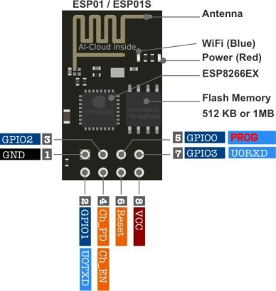
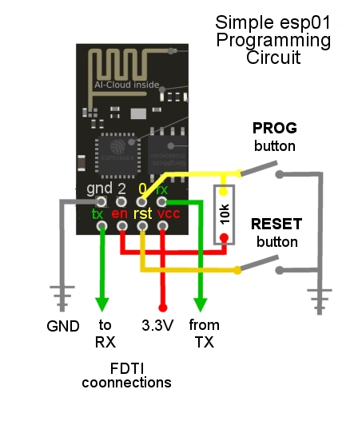
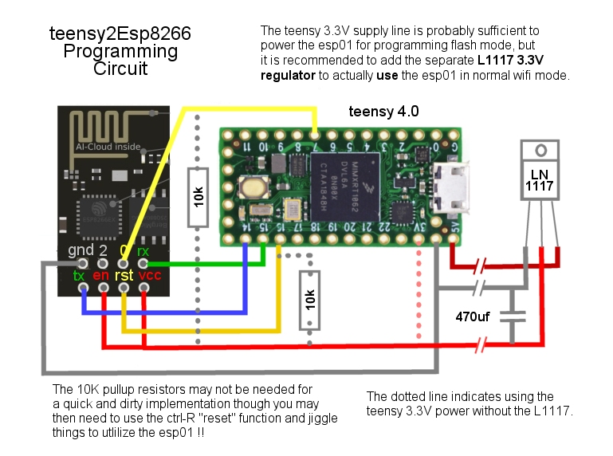

## My esp8266 stuff

These subdirectories contain various things having to do with the esp8266
and specifically the ESP01 module.

- **esp8266Server** - contains a somewhat generalized pass through client/server
  for sending two way serial data over wifi using TCP/IP.  Note that It can act
  **both**  as a Wifi client and server so it is somewhat inappropriately named.
- **teensy2Esp8266** - contains a program that runs on a Teensy that can program
  the esp8266 and act as a MCU client or server using esp8266's using the
  *esp8266Server* program above.  You 'talk' to the esp8266 through the USB
  port with a Putty console to the teensy COM port.

The idea behind the **esp8266Server** program is that you can connect two ESP01's to two
MCUs via serial TX and RX lines and use this software to communicate over wifi somewhat
transparently between them with normal Serial.avaialble(), read(), write(), print(), etc.

In general usage, with an arbitrary MCU, to orchestrate this you either recompile
esp8266Server twice (once for the server and once for the client) with different
#defines for two ESP01 modules, so that one boots as a server and one boots as a
client, or you compile it the same for both modules, probably with a default of
"Server", as checked in, and then effect "station" mode on the client by issuing
a "#HOST 0" command via serial data to the client module.

The **teensy2Esp8266** program runs on a teensy to both demonstrate
the cient server MCU architecture and to serve as a programmer for the esp8266
and *should* handle these details but as currently checked in. You use it by opening
a console (putty) to the teensy (teensies) USB port nd see that it can send chars
back and forth.

In addition to the esp8266Serrver this project contains the following more or
less obsolete subprojects for posterities sake.

- **adxl345onEsp8266** - my first foray into the esp8266, I used it to
  connect to an **adxl1245 accelerometer** and transmit the x, y, and z,
  changes which I then somehow plotted in the Arduino IDE plotter window.
  There were also experiments with UDP verus TCP/IP, MDNS, and sending binary
  data lost in the past.  I even wrote a specific Perl win10 client with
  UDP/TCP while messing around.
- **windowsClient** - contains a rudimentary win10 Perl console application
  using UDP/TCP (in previous version in the repository) to communicate with
  adxl345onEsp8266 and then later, early versions of the generalied esp8266Server.

### Flash Original AT Coommand Firmware?

In general I believe it is a waste of time to learn to re-flash an ESP01
with the "original" AT style firmware.  I spent the time to try to "fix"
a number of these cheap wifi modules, searching out the images, learning
to use arcane flashing tools that require knowing specific addresses and
pieces of binary images to load into the module to get it back to the
"original" firmware and the AT command set.

And you still have to understand the esp8266 boot modes and implement
in hardware some buttons or jumper cables and follow a specific sequence
to boot the espp8266 in "flash" mode to program it, versus booting it in
"normal" run mode to run whatever program is on it.

In any case, I found it to be **much** easier to simply write programs
for the esp8266 in the Arduino IDE that implement the functionality I want
than to try to find and burn the original AT command software and write
funky programs to use it.  Hence I never even wrote a progam that used the
ESP01/esp8266 in that supposedly simpler model.  I don't think it's simpler.

### esp8266 ESP01 Programming (boot modes)

In general, the RX and TX pins are an active serial port.

The esp8266 may be booted (reset) in one of two ways: "flash" mode or "normal" mode.
In general it is wired with VCC, GND, and CH_PD held high (tied directly to VCC).
The RESET pin must be high to run, and is toggled low for 50ms to to reset themodule.

- To boot in "normal" mode GPIO_0 and GPI0_0_PROG must be floating or be held high during
a boot/reset cycle.
- To boot in "flash" mode GPIO_0_PROG should be pulled low during a boot/reset cycle.

The module can be powered and programmed with just a FTDI Serial board by twiddling
cables and connections to effect the correct behavior vis-a-vis the Arduino IDE
versus having your program run.  You could then see if it's working by monitoring
and/or connecting to it via Wifi and no circuit board technically would be needed.

But soon you will want to create a breadboard with a RESET button and a button
to pull GPIO_0_PROG low (against a pullup resitor), even with just the FDTI
programming approach.  Here is a circuit that provides that functionality.

To use it, BEFORE you start your build in the Arduino IDE you press and hold
both the RESET and the PROG buttons for a second and then RELEASE the
RESET button so the module boots with GPIO_0_PROG low into flash mode.  If
it works then the Arduino IDE will succesfully communicate with the esp8266 and
download the program.    Note the following requirements for the Arduino IDE:

- Arduino Board Manager must contain "Community ESP8266" board set
- Use first generic ESP8266 board in Arduino IDE

It is a short step from there to insert a MCU in place of the FDTI to allow software
control of the bootup sequence.  Unfortunately an Arduino Nano is not well suited
to this role due to it's lack of multiple UART hardware serial ports.  Therefore
I chose to use a (variety of) Teensy processors thanks to their small form factor
and plethora of hardware serial ports.  See below for a circuit diagram compatible
with the teensy2Esp8266 sketch.

### POWER SUPPLY AND CAPACITORS

The 3.3V regulator on the teensy 4 series boards is generally not
capable of driving the ESP01 module.  In my circuit I provide a
separate **L1117 3.3V regulator** to power the ESP01.

In addition I learned the very hard way, through many frustrating
resets of the ESP8266 that it is **necessary to have a big (470uf)
capacitor** on the 3.3v supply to handle the hungry power requirements
of the ESP01.

I have also heard you should put a 0.1uf (100 nf)
capacitor across VCC (and most other pins) and ground to help with
noise problems but I am not doing that at this time and it seems
to be working "ok".

### Serial Baud Rates

The esp8266 automatically switches to 78440 baud when placed in "flash"
programming mode.  Therefore were you to want to use the higher 115200
baud rate on the serial port during "normal" operations AND use the
same MCE for progrmming/flahsing it, the program needs to know to
switch to 78440 when in programming mode.

I have implemented schemes where I did that, but in the end it is
best to just have the teensy and the ESP8266 locked into the 78440
baud rate.  It not only simplifies the switch to programming mode
but allows you to "see" the (somewhat random) text the esp8266
spits out when it enters programmign mode ... instead of a bunch
of gobbledy gook on your screen.

### GPIO Pins

Once the module is booted normally you can use the GPIO pins.  In practice,
due to the boot up requirements, assuming you are going to hook them up
to something, to use the GPIO pins effectively requires pull up
resistors so that it boots normally before your program stsrts running and
only you *might* be able to get away with it, depending on the external circutry.

### Please see my *Tumbller project*

I provide the above circuit diagrams for reference only.   In my later
project I implemented a more robust circuit that uses a teensy 4.0
to both **program** the esp8266 and to do something useful by *using*
the esp8266 as a pass through serial device to the robot.
